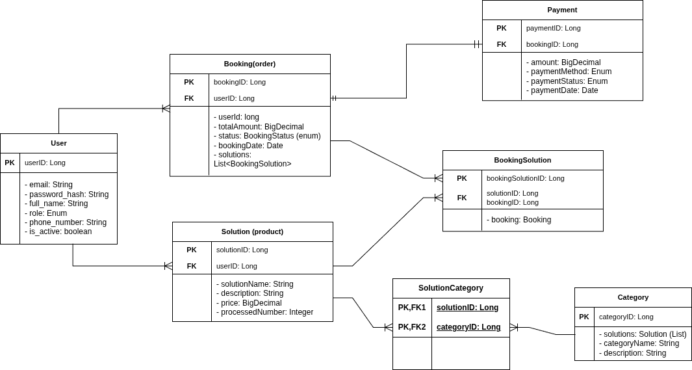

# Jobs Connecting Platform

# AI/ML Integrated JobConnect Microservices Platform

     

> **A (Full Stack Web Application) scalable, microservices-based marketplace connecting "Solution Seekers" with service "Providers". Users can discover and book professional services across categories like Plumbing, IT Support, Cleaning, and Education. The platform features an intelligent AI Dispatcher that automatically categorizes vague user requests using a custom NLP model, trained on synthetic data generated by a fine-tuned LLM.**

---

# Quick Demo
[walkthrough video.mp4](note/walkthrough%20video.mp4)

---

# Key features
- **Modular & Testable Architecture**: 
  - this application (BE) strictly adhere **Dependency Injection (DI) design pattern**, ensuing decoupling between service components. This ensures the codebase maintainable, and allowing for seamless unit testing with mock dependencies
- **Distributed Microservices Architecture**: 
  - utilizing Spring Ecosystem, featuring centralized configuration such as **Discover (Netflix Eureka)**, **API Gateway**.
- **Event-driven Communication**: 
  - this is used for implementing asynchronous messaging using **Kafka**. Payment, and Booking services use this for conforming booking, and update payment status. Also, services communication uses Kafka to optimize performance while on users peak period, avoiding crashing server.   
- **AI/ML**: 
  - this system integrates an **NLP Inference Engine** to classify unstructured user requests. For example, user: "My sink is broken", model returns "Plumbing". String value will be compared to solution_name on database to return the solution entity corresponding to the user's request. The model is trained on training dataset generated by **LLM fine-tuning, quantization model - unsloth/phi-3-mini**.
- **Security & Login**: 
  - secured all microservices endpoints using Auth Service which implements OAuth2 and JWT, ensuring stateless, secure authentication for users.
- **Dockerization/Shipping**: 
  - the application is packed in Docker compose, and is ready to run on any operating system or different machines.
- **Interactive Frontend**: 
  - Server-Side Rendered (SSR) user interface built with Next.js (React). Features distinct, secure workflows for different user roles (Seeker vs. Provider) with real-time status updates

---

# Microservice Architecture
| Service Name | Port   | Description |
| :--- |:-------| :--- |
| **Gateway Service** | `8060` | Single entry point (API Gateway). |
| **Discovery Service** | `8061` | Service Registry (Eureka). |
| **Config Service** | `8088` | Centralized Configuration. |
| **Auth Service** | `8086` | User Registration & JWT Issuance. |
| **User Service** | `8085` | User Profile Management. |
| **Job Service** | `8083` | Job Posting & Management. |
| **Booking Service** | `8082` | Booking Logic & Kafka Events. |
| **Payment Service** | `8081` | Transaction Processing. |
| **ML Service** | `5000` | AI Categorization API (Python). |
---

# AI/ML workflow
- The AI approach is split into (1) Offline Training - GPU intensive, and (2) Online Inference CPU optimization.

### 1. Synthetic Data Generation (Offline), generate on local machine.
- I use **Phi-3-mini** with **Unlsoth** prefix which is quantized to 4-bit model to generate diver, realistic user request simulation.

* **Generator:** Custom `MyGenerator` class prompts the LLM to act as diverse customers.
* **Model:** `unsloth/Phi-3-mini-4k-instruct-bnb-4bit`
* **Output:** `train.jsonl` (more than1000+ categorized examples)

### 2. Natural Language processing in text classifying.
- The label is matched with category name on database.
- The model is trained to classify user request in these categories.
- The output training data is first being cleaned, removing unnecessary characters.
- The LinearSVC is chosen due to its extremely light weight, fast inference speex, and robustness on small datasets which suitable for limited CPU available on VPS.

# Database

---

# Tech Stack
- **Frontend**: 
  - Next.js (React): Server side rendering and responsive UI.
  - SCSS/Tailwind: Modular and modern styling.
- **Backend (Microservices)**: 
  - SpringBoot: Core framework
  - Spring Cloud: Gateway, Discovery, and Config Service.
  - Spring Security: OAuth2, JWT - JSON Web Token
- **AI/ML**: 
  - Flask-RestFul API: backend framework manage model API calling.
  - Scikit-Learn: Natural Language Processing classifying tasks using Linear SVC.
  - UnSloth (Phi-3): Quantization LLM fine-tuning for synthetic data generation.
  - Pandas: Data manipulation and preprocessing.
- **Database and Infrastructure**: 
  - PostgreSQL: primary relational database. 
  - Apache Kafka, Zookeper: Event driven messaging.
- **Containerization and orchestration**: 
  - Docker, Docker Compose, DigitalOcean VPS (Ubuntu/Linux).
- **Tools and Mics**: 
  - Postman (API Testing), Git/GitHub, Swap Memory Optimization (Linux), Ngrok (Local Tunneling)
- **Production environment**: 
  - DigitalOcean VPS